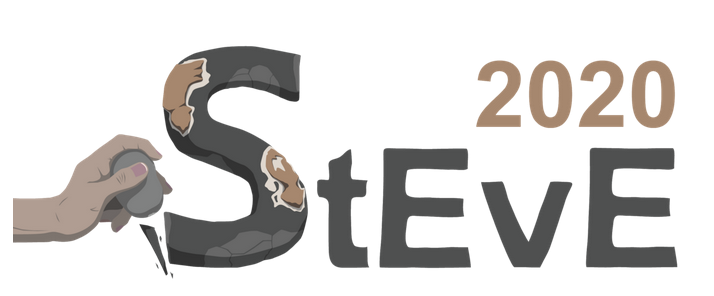
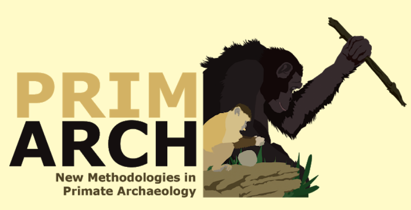

# Conferences and Workshops

## [Meeting StEvE 2020](https://uni-tuebingen.de/en/180663)
 
*Co-organizer* 
*November 13th 2020, virtual* 
 
The annual symposium of Students in Ecology and Evolution (Meeting StEvE) is the avenue for PhD students of the EVEREST graduate school at University of Tübingen to present and discuss their work through a series of oral and poster sessions.

## [PRIMARK](https://sites.google.com/view/primarch-workshop/home?authuser=0)
 
*Co-organizer* 
*February 27th and 28, 2020, Tübingen, DE* 
 
The aim of PRIMARK (The New Methodologies in Primate Archaeology Workshop) is to bring together researchers from across various universities interested in primate archaeology. The workshop consisted of presentation and discussion sessions on the most recent approaches to studying primate archaeology. The main focus of the workshop is to share and learn about the methods that different research groups are using in order to gain insights into the evolution of human technology through the study of primate tool use.
